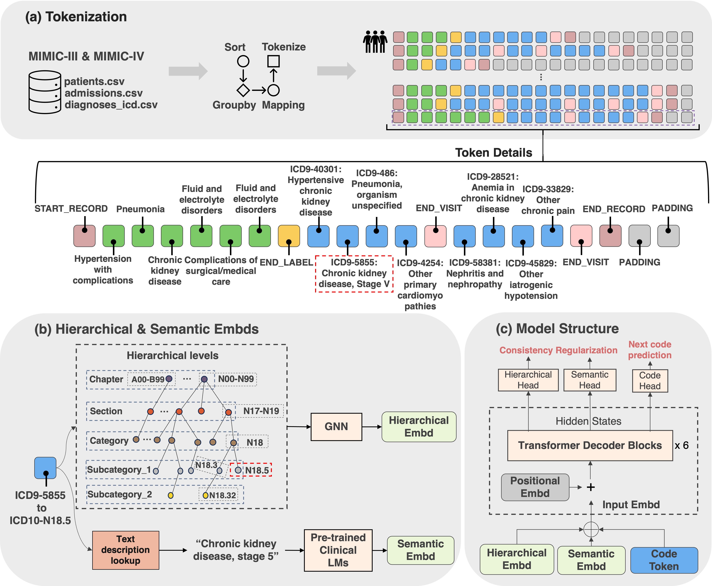

# [Generating Clinically Realistic EHR Data via a Hierarchy- and Semantics-Guided Transformer (HiSGT)](https://arxiv.org/pdf/2502.20719)



#### 📂 Project Structure
```
|--- baselines/          # Model implementations, training, and sampling scripts
|--- data/               # Raw and processed datasets
|--- evaluation/         # Evaluation metrics
|--- output/             # Experiment outputs (logs, checkpoints, synthetic data, evaluation results, etc.)
|--- scripts/            # Scripts for executing experiments
```
---

## 🚀 Quick Start 

### 1️⃣ Setup Python Environment
```bash
conda create -n hisgt python==3.13.0 -y
conda activate hisgt
pip install --upgrade pip
pip install -r requirements.txt
```
### 2️⃣ Prepare the Dataset
Follow the README files in [data/mimiciii/](https://github.com/jameszhou-gl/HiSGT/blob/master/data/mimiciii/1.4_convert_icd10/README.md) and [data/mimiciv/](https://github.com/jameszhou-gl/HiSGT/blob/master/data/mimiciv/2.2_icd9_subset_convert_icd10/README.md) for dataset preparation.
This includes downloading raw MIMIC-III v1.4 and MIMIC-IV v2.2 datasets, extracting patient sequnces, processing them for model training, and constructing additional hierarchical and semantic embeddings.
### 3️⃣ Train Models, Generate Synthetic Data, and Evaluate
Run the following scripts to train HiSGT and baselines. If Slurm is not available, you can adapt them into standard Bash commands.
🔹 **For MIMIC-III:**
```bash
sbatch scripts/mimiciii_1.4_convert_icd10/slurm_gpu_hisgt.sh   # Train HiSGT
sbatch scripts/mimiciii_1.4_convert_icd10/slurm_gpu_baselines.sh  # Train baselines

```
🔹 **For MIMIC-IV:**
```bash
sbatch scripts/mimiciv_2.2_icd9_subset_convert_icd10/slurm_gpu_hisgt.sh  # Train HiSGT
sbatch scripts/mimiciv_2.2_icd9_subset_convert_icd10/slurm_gpu_baselines.sh  # Train baselines
```
These scripts will handle model training, synthetic data generation, and evaluation metrics computation.

### 📝 Acknowledgments
We acknowledge the [HALO](https://github.com/btheodorou99/HALO_Inpatient) and [ETHOS](https://github.com/ipolharvard/ethos-paper), upon which some of our baseline implementations are built and the icd-9 to icd-10 mapping file is borrowed from. We also thank [Joel Jacob](https://github.com/debugst1ck) for his contributions in reproducing the EVA and SynTEG methods.

## :white_check_mark: Citation

If you find our work useful in your research, please consider citing:

```tex
@misc{zhou2025generatingclinicallyrealisticehr,
      title={Generating Clinically Realistic EHR Data via a Hierarchy- and Semantics-Guided Transformer}, 
      author={Guanglin Zhou and Sebastiano Barbieri},
      year={2025},
      eprint={2502.20719},
      archivePrefix={arXiv},
      primaryClass={cs.LG},
      url={https://arxiv.org/abs/2502.20719}, 
}
```
